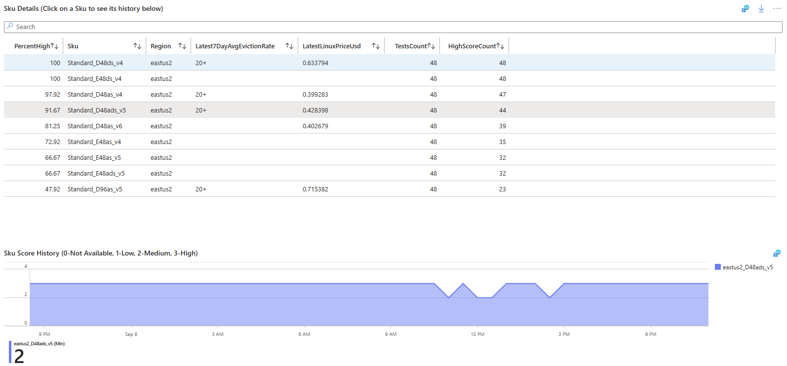

# Spot Placement Score analysis tool
### By Luis Feliz

This tool analyzes Azure Spot Placement Scores for virtual machine SKUs across different regions.

### See which SKUs score high the most


### Analyze the list of Skus, eviction rates, price, and score history


## Deployment

### Requirements
- Access
On the subscription or pre-created resource group:
   - Owner (Due to configuration of RBAC permissions)<br>
                --or--
   - Contributor + User Access Administrator
- Tools
   - Azure CLI
   - PowerShell
   - If using Azure Shell, select Linux Bash, and then enter powershell mode using "pwsh"

## Deployed resources
This script deploys the following required resources:
- Azure Function App and App Service plan
- Azure Storage Account
- Azure Log Analytics workspace
- Azure Application Insights
- Data Collection endpoints and Rules
- Virtual network, subnets, and private endpoints and zones
- RBAC settings for the Storage account, and Data Collection Rule
- Azure Workbook
- Function Script code
- For internal employees: This solution is SFI compliant

## To deploy the solution
1. Open a PowerShell terminal or [Azure Cloud Shell](https://shell.azure.com).  If using Cloud Shell, you can select PowerShell or Bash (then run pwsh)
2. Clone the repository
    ```powershell
    git clone https://github.com/luisfeliz79/AzureSpotSkuAnalyzer.git
    ```
3. Navigate to the cloned directory, deployment directory.
   ```powershell
   cd ./AzureSpotSkuAnalyzer/deployment
   ```
4. Run the deployment script using the following command:
   ```powershell   
   # Authenticate to Azure if needed
   az login --tenant "<your-tenant-id>"

   # Deploy the Azure functions based solution
   ./deploy-azure-functions-solution.ps1 `
      -subscription "<your-subscription-id>" `
      -resourceGroupName "<your-resource-group-name>" `
      -location "<azure-region>"
   ```

## To update the SKUs and regions
### Limits
- The maximum number of recommended SKUs is 15 to avoid throttling
- The maximum number of regions that can be analyzed is 5
### Steps
1.  Navigate to the cloned directory, deployment directory.
      ```powershell
      cd ./AzureSpotSkuAnalyzer/deployment
      ```
2. Run the deployment script using the following command:
   ```powershell
   
   # Authenticate to Azure if needed
   az login --tenant "<your-tenant-id>"

   # powershell
   ./update-function-app-skus-and-regions.ps1 `
   -subscription "<your-subscription-id>" `
   -resourceGroupName "<your-resource-group-name>" `
   -functionName "<your-function-app-name>" `
   -Spot_Regions "eastus2,centralus" `
   -Spot_SKUs "Standard_D48as_v4,Standard_D48ds_v4"
   ```

## Clean up
To delete the resources created by this deployment, you can use the following command:
```bash
   az group delete --name "<resource-group-name>" --yes --no-wait
```
